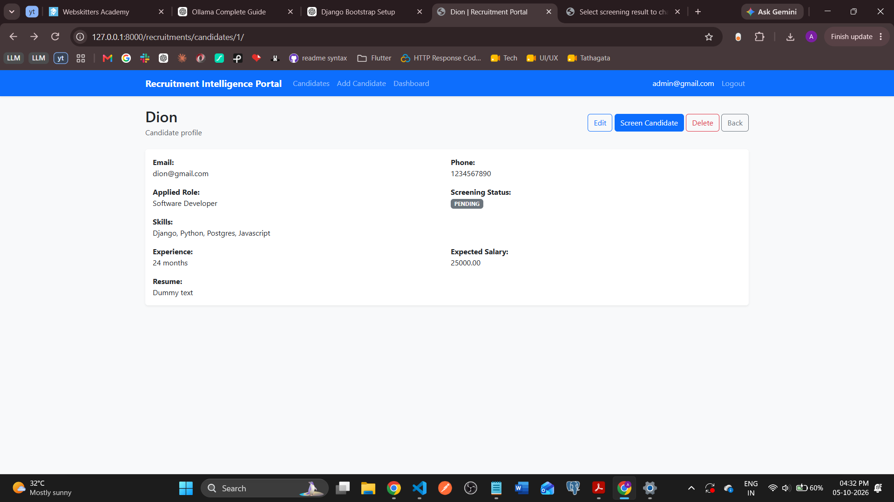

# AI-Enabled Recruitment Screening and Interview Intelligence Portal

An intelligent recruitment management platform built with **Python, Django 5, PostgreSQL, Django REST Framework, Machine Learning, Natural Language Processing, and Deep Learning**. The system automates candidate data ingestion, resume analysis, candidate shortlisting, interview scheduling, and recruitment analytics through a secure, role-based web portal and REST API.

## Table of Contents

* [Project Overview](#project-overview)
* [Key Features](#key-features)
* [Technology Stack](#technology-stack)
* [System Architecture](#system-architecture)
* [Project Structure](#project-structure)
* [Installation and Setup](#installation-and-setup)
* [Database Configuration](#database-configuration)
* [Running the Application](#running-the-application)
* [API Documentation and Testing](#api-documentation-and-testing)
* [Machine Learning, NLP, and Deep Learning](#machine-learning-nlp-and-deep-learning)
* [Security and Validation](#security-and-validation)
* [Testing and Edge Cases](#testing-and-edge-cases)
* [Environment Variables](#environment-variables)
* [Deliverables](#deliverables)
* [Important Implementation Notes](#important-implementation-notes)



## Project Overview

Recruitment teams receive large volumes of candidate applications in CSV and Excel files, alongside resumes, portfolio links, and other candidate information. Manually validating these records, assessing skills, shortlisting candidates, and coordinating interviews can be time-consuming.

This project provides an integrated recruitment screening and interview intelligence portal that automates these workflows while allowing authorized HR personnel, interviewers, and administrators to manage recruitment activities.

The platform combines conventional business rules with machine learning predictions and NLP-based resume analysis. A lightweight TensorFlow/Keras model provides a deep-learning prototype for candidate classification or resume scoring.

**Primary objective:** Build a locally runnable, end-to-end Django application that demonstrates backend engineering, database management, API security, asynchronous processing, data engineering, ML model development, NLP, and deep learning.

## Key Features

### 1. Candidate and Recruitment Management

* Create and manage job roles and candidate profiles.
* Track candidate applications, experience, skills, salary expectations, and notice periods.
* Maintain recruitment batches and screening results.
* Support candidate search, filtering, sorting, and detailed views.
* Customize Django Admin with searchable fields, filters, fieldsets, and useful list displays.

### 2. Candidate Data Ingestion

* Upload CSV and Excel datasets.
* Validate mandatory columns and candidate records.
* Normalize strings, validate email addresses and phone numbers using regular expressions, and validate numeric fields.
* Detect duplicate records and handle missing or malformed values.
* Generate `accepted_rows.csv` and `rejected_rows.csv`, including rejection reasons.
* Process large uploads asynchronously using Celery and Redis.
* Track ingestion job status and progress.

### 3. AI-Assisted Candidate Screening

* Calculate rule-based candidate scores.
* Train and evaluate machine learning classifiers to predict shortlist probability.
* Compare at least two algorithms, such as Logistic Regression and Random Forest.
* Return prediction scores or probabilities through secured API endpoints.
* Cache frequently requested shortlisted candidates by job role using Redis.

### 4. Resume Intelligence and NLP

* Tokenize resume text using NLTK.
* Convert text into numerical representations using a suitable vectorization technique.
* Perform part-of-speech tagging.
* Calculate skill-keyword matching scores against job requirements.
* Combine relevant text-derived features with candidate information for screening.

### 5. Interview Management

* Create and manage interview slots.
* Associate slots with job roles and candidates.
* Support interview scheduling and feedback submission.
* Dynamically retrieve available interview slots using AJAX.
* Prevent duplicate candidate emails before final form submission.
* Store interviewer feedback and track interview outcomes.

### 6. Authentication and Authorization

* Registration, login, and logout APIs.
* JWT access and refresh token flow.
* Role-based access for Admin, HR, and Interviewer users.
* Custom authentication and permission logic.
* Email or OTP verification for new HR users.
* Middleware for request logging and protected dashboard access.

### 7. Reporting and Analytics

* Recruitment dashboard with candidate and application statistics.
* Selected, rejected, and waitlisted candidate counts.
* Role-wise recruitment summaries.
* Salary-range analysis and screening reports.
* Aggregation using `COUNT`, `SUM`, `MIN`, `MAX`, `AVG`, `GROUP BY`, and `HAVING`.
* PostgreSQL raw SQL examples demonstrating joins, filtering, `UNION ALL`, and `INTERSECT`.

## Technology Stack

| Category                    | Technologies                                          |
| --------------------------- | ----------------------------------------------------- |
| Programming language        | Python 3                                              |
| Backend framework           | Django 5                                              |
| REST API                    | Django REST Framework                                 |
| Authentication              | PyJWT, Simple JWT                                     |
| Database                    | PostgreSQL                                            |
| ORM and database access     | Django ORM, PostgreSQL SQL                            |
| Background processing       | Celery                                                |
| Broker and cache            | Redis                                                 |
| Data processing             | NumPy, Pandas                                         |
| Data visualization          | Matplotlib                                            |
| Machine learning            | Scikit-learn                                          |
| Natural language processing | NLTK                                                  |
| Deep learning               | TensorFlow / Keras                                    |
| Frontend                    | Django Templates, HTML, CSS, JavaScript, jQuery, AJAX |
| API documentation           | drf-spectacular / Swagger UI                          |
| API testing                 | Postman                                               |
| File processing             | Python CSV utilities, openpyxl                        |
| Media handling              | Pillow                                                |
| Environment configuration   | python-dotenv                                         |
| Automated testing           | Django Test Framework, Python unittest                |

## System Architecture

The project is divided into six Django applications or Python modules, each responsible for a specific area of the recruitment workflow.

| Application / Module | Responsibility                                                                |
| -------------------- | ----------------------------------------------------------------------------- |
| `accounts`           | User management, authentication, roles, verification, permissions             |
| `recruitments`       | Job roles, candidates, applications, screening results, dashboards            |
| `interviews`         | Interview slots, scheduling, interviewer feedback                             |
| `ingestion`          | CSV/Excel imports, validation, cleaning, batch processing                     |
| `ml_engine`          | Feature engineering, model training, evaluation, predictions                  |
| `nlp_engine`         | Resume preprocessing, tokenization, text vectors, POS tagging, skill matching |

The request flow is:

1. A user uploads a candidate dataset or submits candidate information.
2. The ingestion module validates and cleans the data.
3. Valid records are stored through Django ORM and PostgreSQL.
4. Celery handles long-running ingestion and processing tasks.
5. The ML and NLP modules generate predictions and resume-analysis features.
6. Recruitment and interview modules expose results through Django templates and secured REST APIs.
7. Redis provides task brokering and caching where appropriate.

## Project Structure

The following is the intended project structure.

```text
recruitment_intelligence_portal_ml/
├── manage.py
├── requirements.txt
├── .env.example
├── .gitignore
├── README.md
├── sql_queries.sql
├── notes.txt
│
├── recruitment_intelligence_portal_ml/
│   ├── __init__.py
│   ├── settings.py
│   ├── urls.py
│   ├── asgi.py
│   ├── wsgi.py
│   └── celery.py
│
├── accounts/                               # users, roles, OTP/email verification
│   ├── __init__.py
│   ├── admin.py
│   ├── apps.py
│   ├── backends.py
│   ├── decorators.py
│   ├── forms.py
│   ├── middleware.py
│   ├── models.py
│   ├── permissions.py
│   ├── serializers.py
│   ├── signals.py
│   ├── urls.py
│   ├── validators.py
│   ├── views.py
│   ├── services.py
│   ├── tests.py
│   └── migrations/
│
├── recruitments/                           # JobRole, Candidate, ApplicationBatch, ScreeningResult                   
│   ├── __init__.py
│   ├── admin.py
│   ├── apps.py
│   ├── decorators.py
│   ├── forms.py
│   ├── models.py
│   ├── serializers.py
│   ├── urls.py
│   ├── validators.py
│   ├── views.py
│   ├── services.py
│   ├── sql_queries.py
│   ├── tests.py
│   └── migrations/
│
├── interviews/                             # InterviewSlot, InterviewFeedback
│   ├── __init__.py
│   ├── admin.py
│   ├── apps.py
│   ├── forms.py
│   ├── models.py
│   ├── serializers.py
│   ├── urls.py
│   ├── views.py
│   ├── services.py
│   ├── validators.py
│   ├── tests.py
│   └── migrations/
│
├── ingestion/                              # CSV/Excel ingestion utility + validators
│   ├── __init__.py
│   ├── admin.py
│   ├── apps.py
│   ├── exceptions.py
│   ├── validators.py
│   ├── cleaners.py
│   ├── parsers.py
│   ├── processors.py
│   ├── services.py
│   ├── tasks.py
│   ├── views.py
│   ├── urls.py
│   ├── serializers.py
│   ├── tests.py
│   └── migrations/
│
├── ml_engine/                              # ML training, model, serializers, endpoints
│   ├── __init__.py
│   ├── preprocessing.py
│   ├── feature_engineering.py
│   ├── train.py
│   ├── evaluate.py
│   ├── predict.py
│   ├── model_registry.py
│   ├── serializers.py
│   ├── views.py
│   ├── urls.py
│   ├── tasks.py
│   ├── tests.py
│
├── nlp_engine/                              # NLTK tokenization, POS, keyword match
│   ├── __init__.py
│   ├── preprocessing.py
│   ├── tokenization.py
│   ├── vectorization.py
│   ├── pos_tagging.py
│   ├── skill_matching.py
│   ├── resume_analysis.py
│   ├── deep_learning.py
│   ├── tests.py
|
├── dl_engine/                              # Keras ANN model
│   ├── __init__.py
│   ├── preprocessing.py
│   ├── dataset.py
│   ├── model.py
│   ├── train.py
│   ├── evaluate.py
│   ├── predict.py
│   ├── model_registry.py
│   ├── serializers.py
│   ├── views.py
│   ├── urls.py
│   ├── tasks.py
│   ├── tests.py
│
├── templates/
│   ├── base.html
│   ├── registration/
│   ├── accounts/
│   ├── recruitments/
│   ├── interviews/
│   └── dashboard/
│
├── static/
│   ├── css/
│   │   └── style.css
│   └── js/
│       └── script.js
│
├── media/
│   ├── resumes/
│   ├── uploads/
│   └── images/
│
├── datasets/
│   └── .gitkeep
│
├── scripts/
│   ├── run_ingestion.py
│   └── download_nltk_data.py
│
└── tests/
    ├── test_integration.py
    └── test_permissions.py
```

**Architecture notes:**

* `recruitment_intelligence_portal_ml/` is the Django project package. If your project package has a different name, update the paths accordingly.
* Each Django app should have its own `migrations/` directory and generated migration files.
* Keep JavaScript and AJAX logic in `static/js/script.js`, rather than embedding application logic inside templates.
* Use `services.py` for reusable business logic and keep views focused on HTTP requests and responses.
* Use `backends.py` for custom Django authentication backends where required.
* Use `decorators.py` for reusable function-based view access checks.
* Use `signals.py` only for operations that naturally belong to Django model lifecycle events.
* Keep model artifacts out of source control when they are large or contain sensitive data. Provide documented training commands to regenerate them.
* Do not commit virtual environments, secrets, uploaded candidate records, or private resumes.


## Installation and Setup

### Prerequisites

Install the following separately before running the project:

* Python 3.11 or 3.12, subject to compatibility with the selected TensorFlow release.
* PostgreSQL.
* Redis.
* Git.

Create and activate a virtual environment from the project root.

**Windows PowerShell**

```powershell
python -m venv .venv
.venv\Scripts\Activate.ps1
```

**macOS/Linux**

```bash
python3 -m venv .venv
source .venv/bin/activate
```

Upgrade pip:

```bash
python -m pip install --upgrade pip
```

### Install Python dependencies

Install the core and AI/ML dependencies with:

```bash
python -m pip install "Django>=5.0,<6.0" djangorestframework PyJWT djangorestframework-simplejwt psycopg2-binary celery redis numpy pandas matplotlib scikit-learn nltk tensorflow openpyxl Pillow python-dotenv drf-spectacular
```

The libraries serve the following purposes:

| Package                         | Purpose                                         |
| ------------------------------- | ----------------------------------------------- |
| `Django`                        | Web framework, ORM, templates, sessions, admin  |
| `djangorestframework`           | REST API development                            |
| `PyJWT`                         | JWT functionality                               |
| `djangorestframework-simplejwt` | JWT access/refresh authentication for DRF       |
| `psycopg2-binary`               | PostgreSQL connectivity                         |
| `celery`                        | Background task processing                      |
| `redis`                         | Redis client for task brokering and caching     |
| `numpy`                         | Numerical computation                           |
| `pandas`                        | Dataset cleaning and transformation             |
| `matplotlib`                    | ML visualizations                               |
| `scikit-learn`                  | Feature processing, classifiers, and evaluation |
| `nltk`                          | Tokenization, POS tagging, and NLP              |
| `tensorflow`                    | Deep-learning prototype with Keras              |
| `openpyxl`                      | Reading and writing `.xlsx` files               |
| `Pillow`                        | Image validation and processing                 |
| `python-dotenv`                 | Loading local environment variables             |
| `drf-spectacular`               | OpenAPI schema and Swagger documentation        |

**Compatibility note:** TensorFlow support depends on the Python version and operating system. If installation fails, verify the supported Python version for the TensorFlow release before changing package versions. Do not blindly upgrade NumPy or TensorFlow independently of their compatibility constraints.

After confirming the environment works, save the resolved dependencies:

```bash
python -m pip freeze > requirements.txt
```

For reproducible deployment, commit a tested requirements file rather than relying on an unpinned installation command alone.

### Download NLTK resources

After installing NLTK, download the required datasets and taggers:

```bash
python -m nltk.downloader punkt punkt_tab averaged_perceptron_tagger_eng stopwords
```

The precise resources needed depend on the tokenization and tagging APIs used in the implementation. Verify them with a small local test and document any additional resources required.

## Database Configuration

Create a PostgreSQL database and a dedicated database user with appropriate privileges. Configure the credentials through environment variables.

Example `.env.example`:

```dotenv
DJANGO_SECRET_KEY=replace-with-a-long-random-secret
DJANGO_DEBUG=True
DJANGO_ALLOWED_HOSTS=127.0.0.1,localhost

DB_NAME=recruitment_portal
DB_USER=recruitment_user
DB_PASSWORD=replace-with-a-local-password
DB_HOST=127.0.0.1
DB_PORT=5432

REDIS_URL=redis://127.0.0.1:6379/0

EMAIL_HOST=
EMAIL_PORT=587
EMAIL_HOST_USER=
EMAIL_HOST_PASSWORD=
EMAIL_USE_TLS=True
DEFAULT_FROM_EMAIL=

JWT_ACCESS_TOKEN_MINUTES=30
JWT_REFRESH_TOKEN_DAYS=1
```

These are example variable names; the actual implementation must read the same names from `settings.py`.

Copy `.env.example` to `.env` and supply local values. Never commit `.env` or real credentials to GitHub.

After configuring the database and user model, run:

```bash
python manage.py makemigrations
python manage.py migrate
python manage.py createsuperuser
```

Create the superuser interactively. Do not hard-code admin credentials in the repository.

## Running the Application

### 1. Start PostgreSQL and Redis

Ensure both services are running and accessible through the configured host and port.

### 2. Start Django

```bash
python manage.py runserver
```

Open:

* Web application: `http://127.0.0.1:8000/`
* Django Admin: `http://127.0.0.1:8000/admin/`

The actual page routes depend on the URL configuration implemented in the project.

### 3. Start a Celery worker

Run this in a separate terminal with the virtual environment activated:

```bash
celery -A recruitment_intelligence_portal_ml worker --loglevel=info
```

On Windows, if the default multiprocessing pool does not work in your environment, a development-only alternative is:

```bash
celery -A recruitment_intelligence_portal_ml worker --pool=solo --loglevel=info
```

### 4. Verify ingestion and prediction

Upload a sample candidate dataset and verify:

* The upload is accepted only when its structure is valid.
* Accepted and rejected reports are generated.
* Background task status and errors are visible.
* Candidate records are stored correctly.
* Screening predictions and NLP scores are returned for valid inputs.

## API Documentation and Testing

Swagger documentation should be exposed after configuring `drf-spectacular` and registering the schema views. For example, the project may use:

* Swagger UI: `/api/docs/`
* OpenAPI schema: `/api/schema/`

These paths are proposed defaults, not active endpoints until implemented.

The API should cover:

| API group  | Required functionality                                   |
| ---------- | -------------------------------------------------------- |
| Accounts   | Registration, login, logout, token refresh, verification |
| Candidates | Create, retrieve, update, delete, list                   |
| Ingestion  | Upload dataset, inspect batch status and progress        |
| Screening  | Retrieve screening results and request predictions       |
| Interviews | Retrieve available slots and submit feedback             |
| Analytics  | Candidate counts and recruitment summaries               |

Use Postman to test at least five API requests, including successful and unauthorized requests. Verify authentication headers, request validation, response payloads, and HTTP status codes.

## Machine Learning, NLP, and Deep Learning

### Machine Learning pipeline

The ML pipeline should:

1. Load cleaned candidate records.
2. Remove duplicates and irrelevant features.
3. Handle missing values and invalid numeric data.
4. Treat outliers using a documented strategy.
5. Encode categorical variables.
6. Select features and split the data into training and testing sets.
7. Train at least two classification algorithms.
8. Evaluate the models with suitable metrics.
9. Persist the chosen model and preprocessing pipeline.
10. Serve predictions through an authenticated DRF endpoint.

Use historical selection outcomes as the target label only after defining the label mapping and checking the quality and consistency of the historical data. Prevent target leakage and report class imbalance where relevant.

### NLP pipeline

The NLP component should tokenize and normalize resume text, perform POS tagging, convert text to numeric features, and calculate skill matches against the selected job role.

The skill-matching score should be transparent and explainable. It should supplement, not automatically replace, human recruitment decisions.

### Deep-learning prototype

Build a minimal executable TensorFlow/Keras ANN for shortlist classification or resume-score classification. Document the feature inputs, target labels, training procedure, evaluation results, and inference interface.

The neural network is a separate prototype unless a tested integration strategy demonstrates that it improves the system.

## Security and Validation

* Enforce role-based permissions on both pages and APIs.
* Use Django password hashing and secure JWT configuration.
* Validate uploaded file formats, required columns, file size, and data types.
* Apply CSRF protection to browser-based form submissions and AJAX requests.
* Use environment variables for credentials and secrets.
* Restrict media and resume access to authorized users.
* Avoid exposing personal candidate information in logs or API errors.
* Use parameterized SQL queries for dynamic inputs.
* Prevent duplicate processing when background jobs are retried.
* Return appropriate errors for expired tokens and unauthorized access.
* Never treat an ML prediction as a guaranteed or unbiased hiring decision.

## Testing and Edge Cases

The application must handle the following cases without unexpected crashes or data corruption:

* Invalid file formats.
* Missing mandatory columns.
* Empty uploads.
* Duplicate rows and candidate emails.
* Invalid email addresses and phone numbers.
* Invalid numeric values.
* Missing optional resume text or media.
* Unauthorized dashboard and API access.
* Expired or invalid JWT tokens.
* Failed Celery tasks.
* Missing model artifacts.
* Invalid prediction payloads.
* Repeated ML/NLP execution against existing candidate records.
* Interview slot conflicts and invalid feedback submissions.

Run Django's test suite using:

```bash
python manage.py test
```

Add tests for authentication, role permissions, candidate CRUD, data ingestion, task failure handling, ML inference, NLP edge cases, and API validation.

## Environment Variables

Keep environment-specific settings outside source control.

At minimum, configure:

* Django secret key and debug mode.
* Allowed hosts.
* PostgreSQL credentials.
* Redis URL.
* Email/OTP delivery settings.
* JWT token lifetimes.
* Model artifact locations, if configurable.

Use safe defaults for development, and do not enable debug mode or expose sensitive credentials in a production deployment.

## Deliverables

The completed repository should contain:

1. Complete Django project source code.
2. All six applications/modules and their supporting files.
3. PostgreSQL models and migrations.
4. A working web interface and secured REST APIs.
5. Sample CSV/Excel data for testing.
6. `accepted_rows.csv` and `rejected_rows.csv` generation.
7. At least two trained ML classifiers with evaluation results.
8. A functional NLTK resume-analysis pipeline.
9. An executable TensorFlow/Keras prototype.
10. Celery background jobs and Redis integration.
11. `sql_queries.sql` containing the required SQL examples.
12. `notes.txt` documenting assumptions, implementation decisions, and limitations.
13. API documentation and Postman test evidence.
14. A complete `README.md` with reproducible setup instructions.

## Important Implementation Notes

* Build the application incrementally and verify each phase before generating additional files.
* Keep business logic in reusable services instead of duplicating it across views.
* Use Django ORM for ordinary data operations and raw PostgreSQL SQL for the explicitly required examples.
* Keep all AJAX and jQuery code in `static/js/script.js`.
* Use function-based views as the default architecture for this implementation. **The assessment paper explicitly requests both function-based and class-based views**, so strict compliance requires adding and testing at least the required class-based views.
* Keep authentication, authorization, and data validation separate from model prediction logic.
* Make the ingestion and ML/NLP pipelines repeatable and safe to execute multiple times.
* Do not use React, WebSockets, Docker, Kubernetes, cloud services, or external LLM APIs for the assessment prototype.
* Document the limitations of historical hiring data, model accuracy, and automated candidate scoring.
* Generate the code in small, verifiable units rather than accepting a large untested code dump from an LLM.

---

**Project status:** Development blueprint

**Primary objective:** Demonstrate an integrated Python/Django backend with secure APIs, PostgreSQL, asynchronous processing, machine learning, NLP, and a minimal deep-learning prototype.

**Guiding principle:** Build a working and explainable system first; optimize and extend it only after its core workflows are verified.